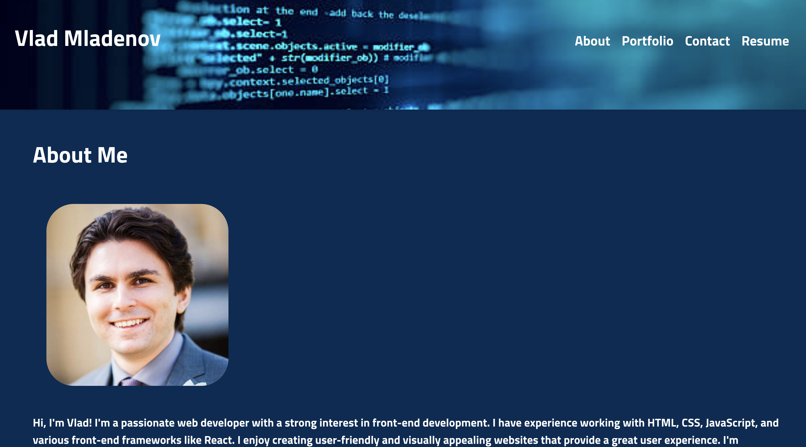
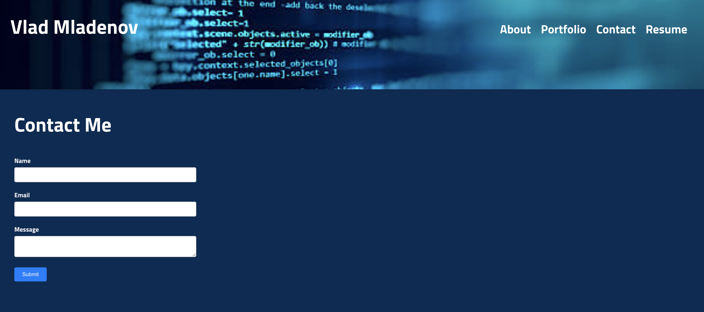
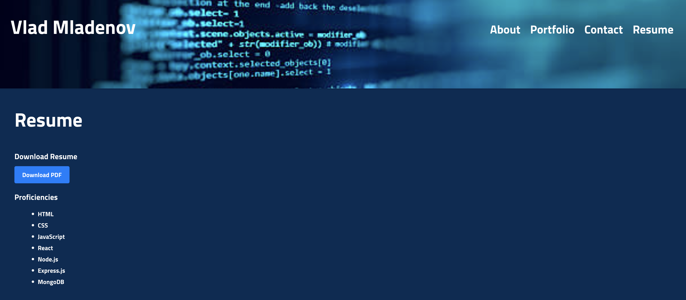

# React-Portfolio

This is a single-page application portfolio for a web developer created using React. It showcases the developer's projects, provides information about the developer, and allows users to contact the developer.

## Features

- Header with navigation menu: The header displays the developer's name and provides navigation links to different sections of the portfolio.
- Sections: The portfolio is divided into several sections, including About Me, Portfolio, Contact, and Resume.
- Active Section Highlight: The navigation titles corresponding to the current section are highlighted.
- Single-Page Application: When clicking on a navigation title, the corresponding section is displayed below the navigation without the page reloading.
- Default Section: The About section is selected by default when the portfolio is loaded for the first time.
- About Section: Displays a recent photo or avatar of the developer and a short bio.
- Portfolio Section: Shows titled images of the developer's projects with links to deployed applications and corresponding GitHub repositories.
- Contact Section: Includes a contact form with fields for name, email address, and message. Validation is performed for required fields and email address format.
- Resume Section: Provides a link to download the developer's resume and lists the developer's proficiencies.
- Footer: Displays text or icon links to the developer's GitHub, LinkedIn, and a third platform profile (e.g., Stack Overflow, Twitter).

## Technologies Used

- React: The portfolio is built using React, a popular JavaScript library for building user interfaces.
- React Scroll: Used for smooth scrolling to different sections of the portfolio.
- CSS: Custom CSS styles are applied for layout, design, and responsiveness.

## Getting Started

To run the portfolio app locally, follow these steps:

1. Clone the repository: `git clone https://github.com/Vlad1slav86/React-Portfolio`
2. Navigate to the project directory: `cd portfolio`
3. Install the dependencies: `npm install`
4. Start the development server: `npm start`
5. Open your browser and visit `http://localhost:3000` to view the app.

## Screenshots

Home Page:

Portfolio Page:

Contact Page:

Resume Page:

## Links

GitHub: https://github.com/Vlad1slav86/React-Portfolio

Demo: https://vlad1slav86.github.io/React-Portfolio/

## License

This project is licensed under the [MIT License](LICENSE).

## Contact

If you have any questions please contact me at vladkb@yahoo.com.
